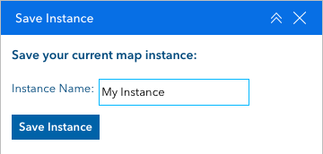
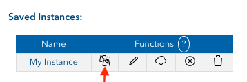
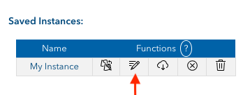
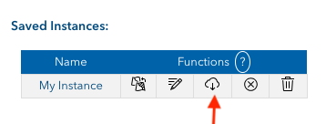
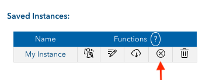
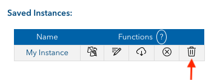

# Save Instance Widget for Experience Builder

The **Save Instance Widget** lets you save and share the current state of your web map in Experience Builder — including extent, visible layers, basemap, graphics, and more. It's inspired by the classic Save Session Widget from Web AppBuilder, but built specifically for ArcGIS Experience Builder.

## 🛠 Installation

You can download the latest compiled version of the Save Instance Widget from [JensenGIS](https://jensengis.com).

## ⚙️ Setup

Once downloaded, follow [Esri’s guide](https://doc.arcgis.com/en/experience-builder/11.0/configure-widgets/add-custom-widgets.htm) on how to add custom widgets to your Experience Builder installation.

1. Place the widget inside your `/widgets` directory.
2. In Experience Builder, go to the **Insert Widget** tab and scroll down to the **Custom Widgets** section.
3. Drag the **Save Instance Widget** onto your toolbar.
4. Configure the widget by selecting a map for it to interact with.

That’s it — you’re ready to go.

## 🚀 Usage

### 💾 Save an Instance
Enter a name for the instance and click the **Save Instance** button.  

### 🔄 Load an Instance
Click the **Load Instance** button to apply a previously saved map state.  

### ✏️ Rename an Instance
Click the **Edit Instance Name** button and enter a new name when prompted.  

### 📥 Download an Instance
Click **Download Instance** to export a `.txt` file containing that instance.  

You can also download **all** saved instances using the **Download Instances** button at the bottom right of the widget.

### 🧹 Clear Instance Graphics
Click **Clear Instance Graphics** to remove any graphics associated with the instance from the map.  

>I'd love to get instance-loaded graphics working with the Esri Draw Widget at some point. It’ll take a bit of setup, but if it’s something people are asking for, I’m happy to start looking into it — just let me know!

### 🗑️ Delete an Instance
Click **Delete Instance** to permanently remove it from your saved list.  

## 🔗 Sharing Instances

To share a saved instance, simply send the `.txt` file to another user. They can import it using the **Upload Instances** button in the bottom-left corner of the widget.

> In the future, I’d love to add support for cloud storage of instances — let me know if that’s something you’d use!

## 🐛 Bugs & Feature Requests

Have a bug to report or a feature idea?  
Please [open an issue on this GitHub repo](https://github.com/svenweb/saveInstanceWidget/issues) or leave a comment in the [Esri Community](https://community.esri.com/t5/arcgis-experience-builder-ideas/save-instance-widget/idi-p/1610260).

I’m also happy to hear requests for:
- Migrating existing Web AppBuilder widgets to Experience Builder
- Building new custom widgets for open-source release or for private use.

Stay tuned — more tools are coming soon!
